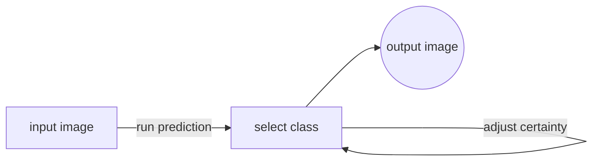

# GUI for rib fracture detection

In order for pathologists to gain access to the trained model for rib fracture detection on PMCT images, we created a simple and user-friendly graphical user interface (GUI). In the following paragraphs, we provide a step-by-step introduction on how to use the GUI.

**Here is a high level flow chart on the general workflow with the GUI:**

