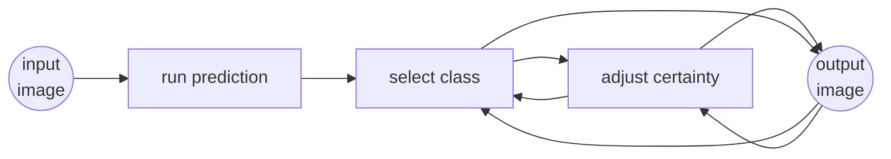
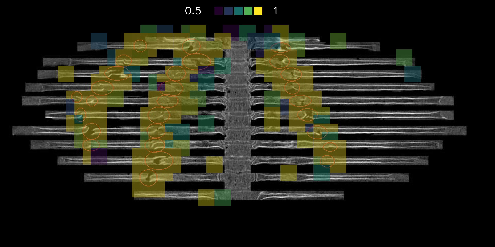

# GUI for the rib fracture detection algorithm

In order to get an easy access to our trained model we created a user-friendly graphical user interface (GUI). The GUI allows a user to upload a 2D projection of a PMCT scan of the rib cage and run the model. After processing the scan the GUI will display the different types of fractures and their positions on the rib cage. The processed image can be downloaded with the predictions.

In the following paragraphs, we provide a step-by-step introduction on how to use the GUI.

**Here is a high level flow chart on the general workflow with the GUI:**



## How to run the script

A simple way to run the script is to install Anaconda and create a separate environment inside Anaconda to avoid conflicts with other exisiting projects:
- To create a separate environment using Anaconda type
```
conda create --name YOUR_ENV python>=3.8
```
(You will need at least Python 3.8)

- Then install the following librairies:

```
conda install -c conda-forge opencv
conda install -c anaconda scikit-learn
conda install -c conda-forge tensorflow
conda install -c conda-forge gradio
```
To run the script type
```
python rib_gui_reduced.py
```
or
```
python rib_gui.py
```
If you want to have predicions for the different displaced fractures ("ad latus", "ad longitudinem cum contractione", "ad longitudinem cum distractione), use the rib_gui.py file, if you think that the label "displaced" is enough use the rib_gui_reduced.py file.

**The model *ResNet50_full_model.h5* is too large to be stored here and can be accessed upon request.**

## Input image

The expected input image to the model is a 2D representation created with the Syngo.via rib unfolding tool CT Bone Reading with a size of **1261 × 999** in **.jpg** format.

## Run prediction

When the button is pressed, the model will predict on the selected image and prepares the masks for the output images.

## Select class

The following radio buttons can be selected:

- *None;* the default image without mask
- *no fracture*
- *nondisplaced*

    in rib_gui.py:
- *displaced latus*
- *displaced longitudinem cum contractione*
- *displaced longitudinem cum distractione*

    in rib_gui_reduced.py:
- *displaced*

The output image with an overlapping prediction mask will be displayed.

## Adjust certainty

The certainty (λ) of the model can be adjusted with a slider from 0.5 to 1 (default value is 0.5); all regions with a predicted value higher than λ will be displayed (so the higher λ, the less regions displayed).

## output image

The output image changes depending on the configurations chosen (class, certainty) and can be downloaded with a click to the icon on the output image (upper right corner).

Sample image with prediction mask:


