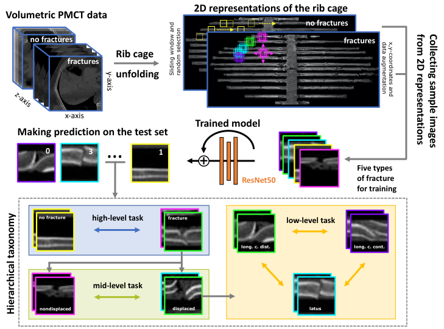

# Classification of rib fracture types from postmortem computed tomography images using deep learning

## Description
Purpose: Human or time resources can sometimes fall short in medical image diagnostics, and analyzing images in full detail can be a challenging task. With recent advances in artificial intelligence, an increasing number of systems have been developed to assist clinicians in their work. In this study, the objective was to train a model that can distinguish between various fracture types on different levels of hierarchical taxonomy and detect them on 2D-image representations of volumetric postmortem computed tomography (PMCT) data.
Methods: We used a deep learning model based on the ResNet50 architecture that was pretrained on ImageNet data, and we used transfer learning to fine-tune it to our specific task. We trained our model to distinguish between “displaced”, “nondisplaced”, “ad latus”, “ad longitudinem cum contractione”, and “ad longitudinem cum distractione” fractures.
Results: Radiographs with no fractures were correctly predicted in 95%-99% of cases. Nondisplaced fractures were correctly predicted in 80%-86% of cases. Displaced fractures of the “ad latus” type were correctly- predicted in 17-18% of cases. The other two displaced types of fractures, “ad longitudinem cum contractione” and “ad longitudinem cum distractione”, were correctly predicted in 70-75%  and 64-75% of cases, respectively.
Conclusion: The model achieved the best performance when the level of hierarchical taxonomy was high, while it had more difficulties when the level of hierarchical taxonomy was lower. Overall, deep learning techniques constitute a reliable solution for forensic pathologists and medical practitioners seeking to reduce workload.

## Overview on workflow and evaluation

## Authors and acknowledgment
Victor Ibanez, Dario Jucker, Lars C. Ebert, Sabine Franckenberg, Akos Dobay

## Publication
DOI

## Contact
akos.dobay@uzh.ch

